# st0r — UrBackup Web GUI

A modern, full-featured web interface for managing and monitoring [UrBackup](https://www.urbackup.org/) servers. Built with React + TypeScript, designed to run directly on your UrBackup Linux server.

[](https://github.com/agit8or1/St0r/stargazers)
[](https://github.com/agit8or1/St0r/releases)
[](LICENSE)

⭐ If St0r saves you time, a star helps others find it!

---

## Features

### Core
- **Dashboard** — Real-time overview: client health, storage usage, active tasks, replication status. All stat cards are clickable links.
- **Client Management** — Monitor all backup clients with file/image status, last-seen, IP, OS, and UrBackup client software version. Filter by online/offline/failed.
- **Endpoint Settings** — Per-client backup configuration: file paths, retention counts, backup windows, internet mode, auth key management.
- **Backup Controls** — Start/stop full or incremental file and image backups from the web UI with inline status feedback.
- **Backup History** — Complete per-client backup history with type, size, duration, and status.
- **Storage Limits** — Set per-client storage caps with configurable warn/critical thresholds; progress bar in the endpoint list highlights clients approaching or exceeding their limit.

### File Operations
- **File Browser** — Browse any backup snapshot by date; download individual files.
- **File Restore** — Select files from a backup and restore them directly to the client machine.
- **Bare Metal Restore** — Download UrBackup Restore CD/USB ISO with step-by-step instructions.

### Monitoring
- **Activity Monitoring** — Live and historical backup activities. Running backups show real-time progress, speed (MB/s), and ETA. Completed image backups are grouped by session (e.g., "Image Backup (C:, D:)").
- **Storage Visualization** — Pie chart of used vs. available backup storage per client.
- **Logs** — Browse UrBackup server logs from the web UI.
- **Alerts** — Configurable alert rules with history.
- **Reports** — Backup status reports.

### Replication
- **Full Standby Replication** — Mirror the UrBackup server to one or more DR targets via SSH/rsync.
- **Replication Targets** — Add/edit/delete targets with SSH key or password auth, bandwidth limits, path mapping.
- **Run History** — Per-target run log with step-by-step progress viewer.
- **Alert Channels** — Email and webhook notifications for replication failures, stale targets, and recoveries.
- **Scheduled + Hook-based Triggers** — Trigger replication on a schedule, after each backup completes, or both. Configurable debounce.
- **AES-256-GCM encrypted credential storage** — SSH private keys and passwords are encrypted at rest.

### Settings & Admin
- **Server Settings** — Manage global UrBackup settings (internet mode, backup windows, retention, quotas) directly from the GUI.
- **Internet Client Setup** — Generate Windows/Linux/macOS installers with the correct server address embedded.
- **User Management** — Role-based access control; create/delete users; admin vs. read-only roles.
- **2FA** — TOTP two-factor authentication per user (TOTP compatible with Google Authenticator, Authy, etc.).
- **Customer Management** — Group clients by customer organization.
- **Profile** — Change your own password and 2FA settings.

### Updates
- **St0r auto-update** — Built-in update checker polls GitHub every 30 minutes; one-click update with live log output, progress bar, and automatic rollback on failure.
- **UrBackup server update** — About page shows installed vs latest UrBackup server version; one-click apt-based upgrade with live terminal output.
- **Force reinstall** — Repair-mode reinstall of the current version without needing a newer release.

### UI / UX
- **Dark Mode** — System-aware with manual toggle; preference persisted across sessions.
- **Responsive** — Works on desktop and tablet.
- **Tooltips** — Contextual hover hints throughout the UI; can be toggled in Settings.
- **Bug Reporting** — In-app bug report form.

---

## Screenshots

### Dashboard
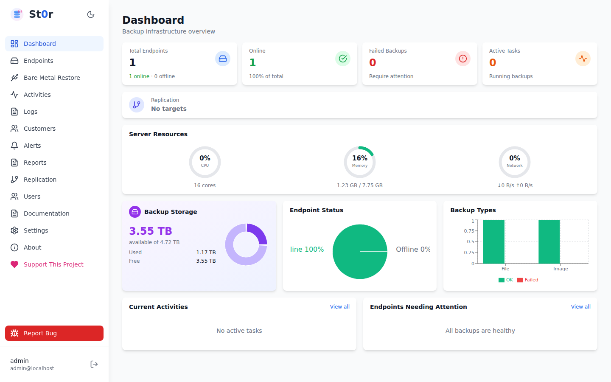

### Endpoints
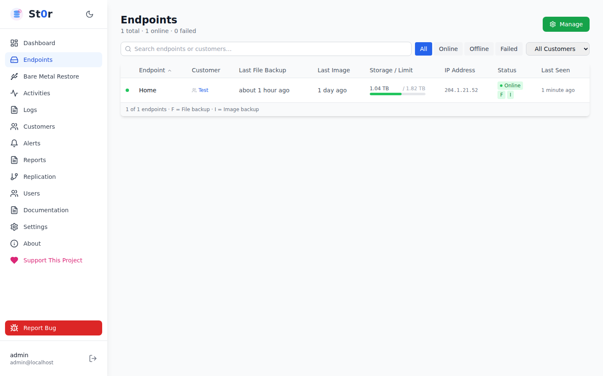

### Endpoint Detail
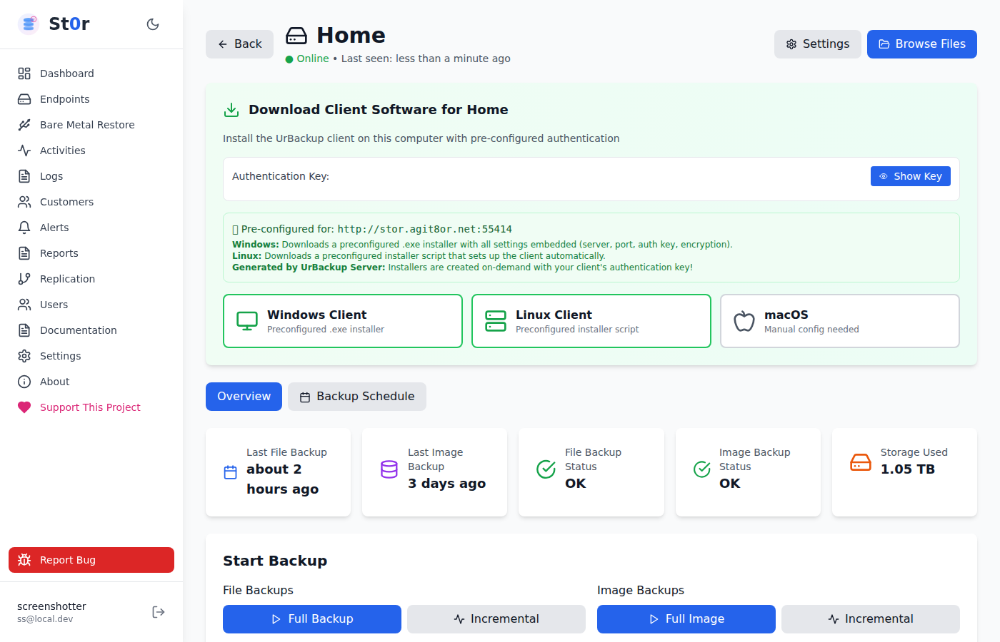

### Endpoint Settings — Backup Paths
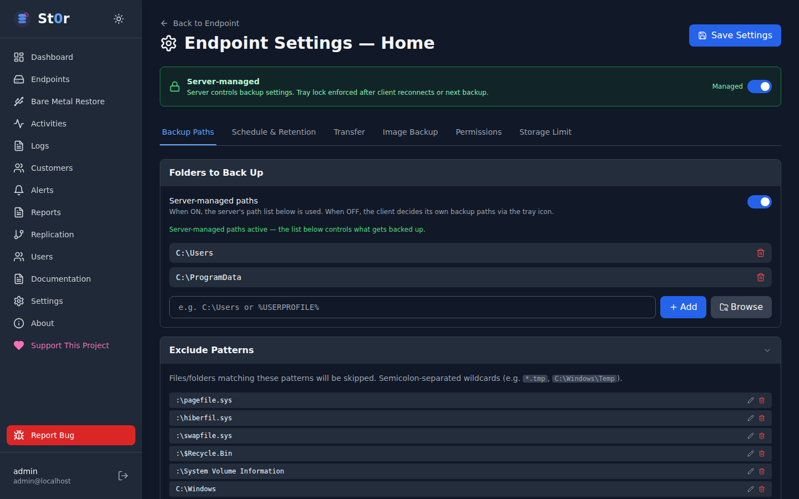

### Endpoint Settings — Schedule & Retention
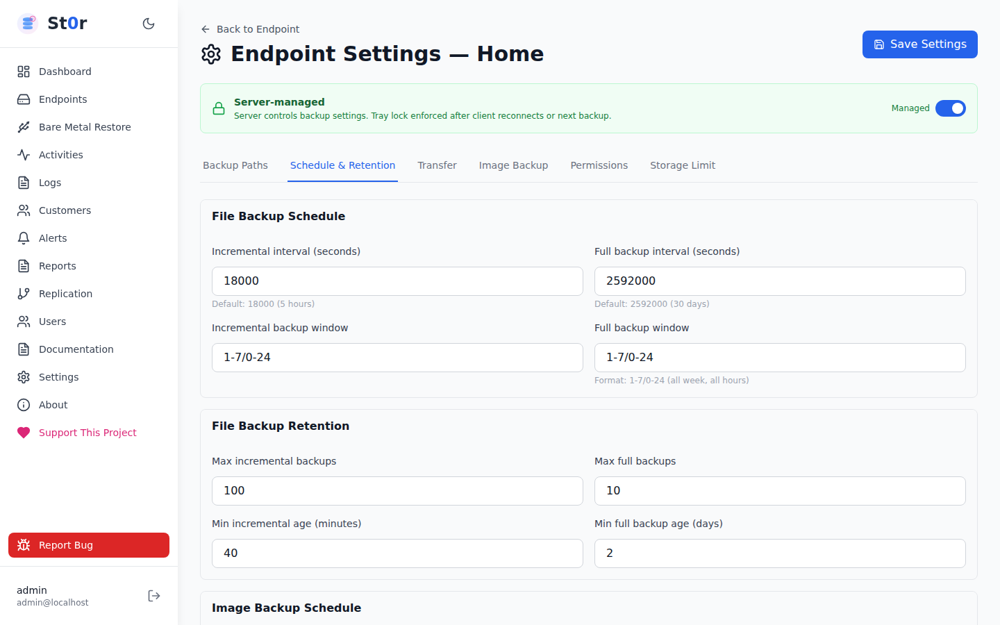

### Endpoint Settings — Transfer
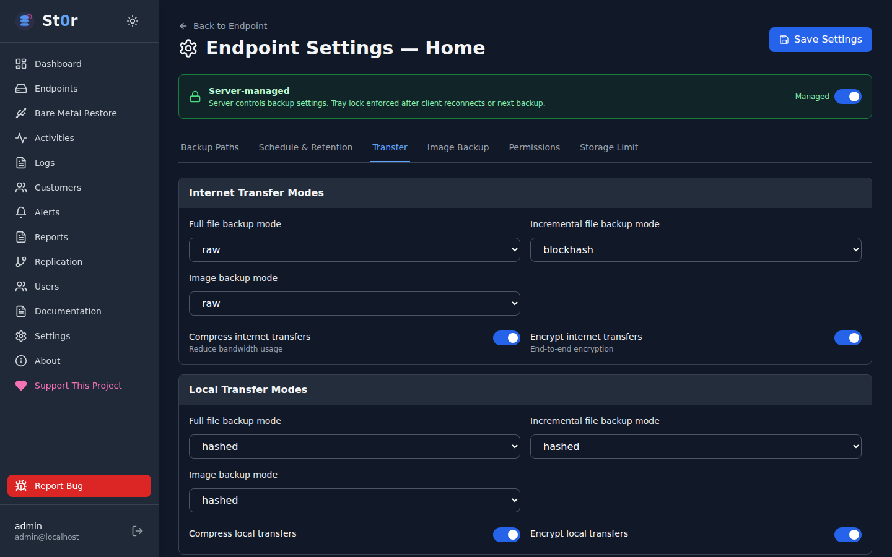

### Endpoint Settings — Image Backup
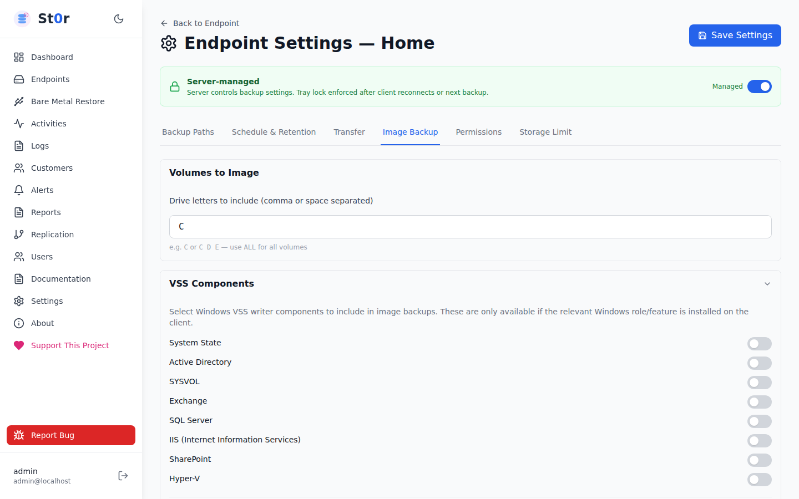

### Endpoint Settings — Permissions
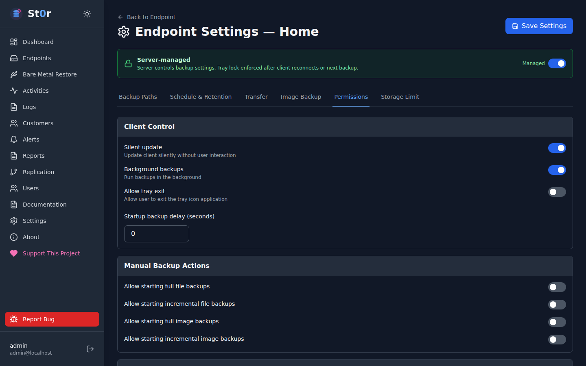

### Endpoint Settings — Storage Limit
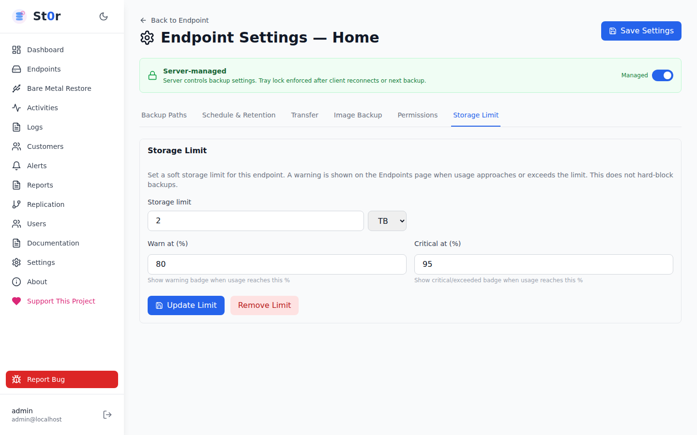

### Activity Monitoring
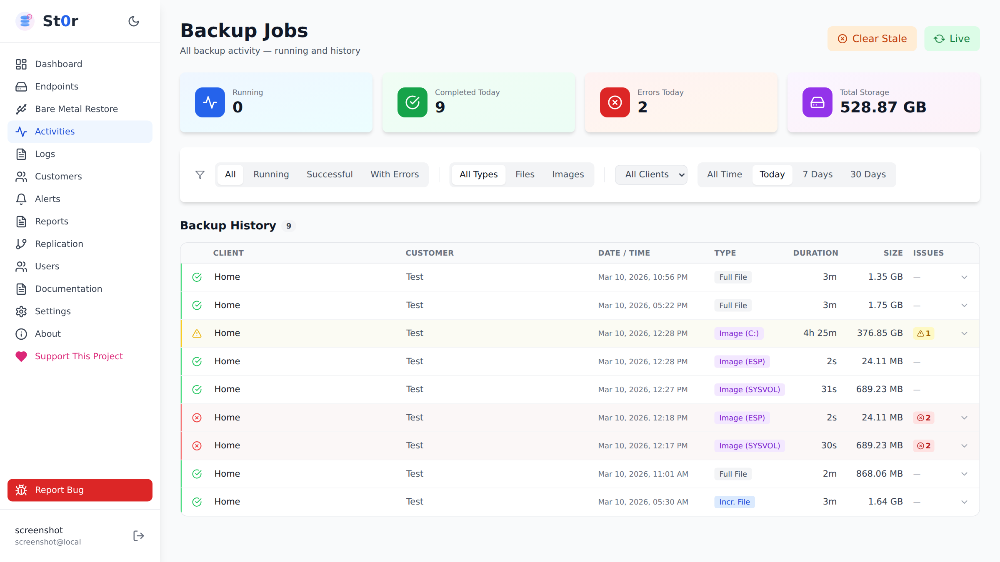

### Replication Management
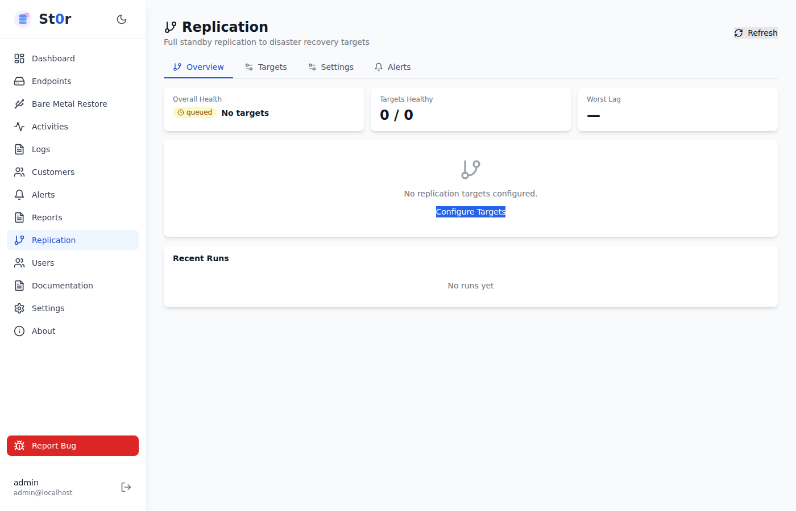

### File Browser
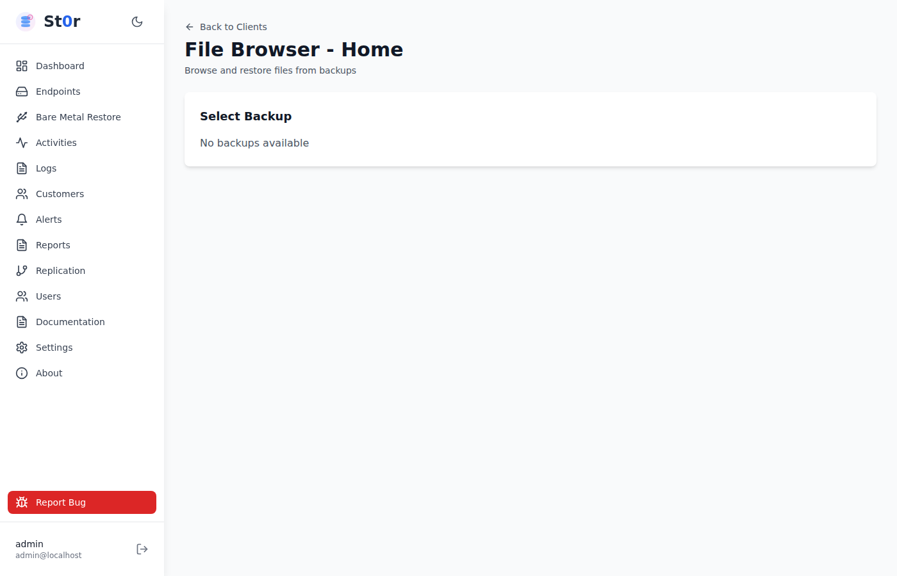

### Server Settings
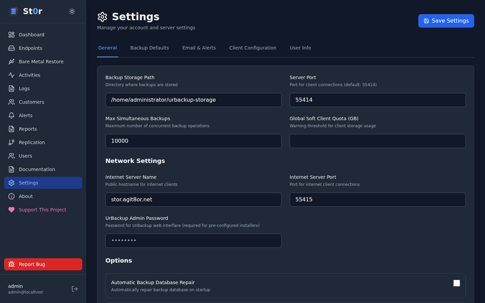

---

## Requirements

- **Linux server running UrBackup Server 2.5.x or later**
- Must be installed **on the same machine** as UrBackup (reads UrBackup's SQLite DB directly)
- Node.js 20+, MariaDB, Nginx

---

## Quick Installation

### Automated (Recommended)

```bash
curl -fsSL https://raw.githubusercontent.com/agit8or1/St0r/main/install.sh | sudo bash
```

Or download first:

```bash
wget https://raw.githubusercontent.com/agit8or1/St0r/main/install.sh
chmod +x install.sh
sudo ./install.sh
```

The installer will:
1. Install Node.js 20, MariaDB, Nginx
2. Create the database and apply the schema
3. Build the backend and frontend
4. Configure Nginx as a reverse proxy
5. Install and start the `urbackup-gui` systemd service

After installation, access the GUI at: **http://YOUR_SERVER_IP**

### Manual Installation

#### 1. Install Dependencies

```bash
sudo apt-get update
sudo apt-get install -y curl gnupg2 nginx mariadb-server

# Node.js 20
curl -fsSL https://deb.nodesource.com/setup_20.x | sudo bash -
sudo apt-get install -y nodejs
```

#### 2. Configure MariaDB

```bash
sudo systemctl start mariadb && sudo systemctl enable mariadb

sudo mysql -u root <<'EOF'
CREATE DATABASE urbackup_gui;
CREATE USER 'urbackup'@'localhost' IDENTIFIED BY 'CHANGE_ME';
GRANT ALL PRIVILEGES ON urbackup_gui.* TO 'urbackup'@'localhost';
FLUSH PRIVILEGES;
EOF

sudo mysql -u root urbackup_gui < database/init/01_schema.sql
```

#### 3. Install Application

```bash
sudo mkdir -p /opt/urbackup-gui
sudo cp -r . /opt/urbackup-gui/
sudo chown -R $USER:$USER /opt/urbackup-gui

# Backend
cd /opt/urbackup-gui/backend
npm install
npm run build

cat > .env <<EOF
NODE_ENV=production
PORT=3000
DB_HOST=localhost
DB_PORT=3306
DB_NAME=urbackup_gui
DB_USER=urbackup
DB_PASSWORD=CHANGE_ME
JWT_SECRET=$(openssl rand -hex 32)
APP_SECRET_KEY=$(openssl rand -hex 32)
URBACKUP_DB_PATH=/var/urbackup/backup_server.db
URBACKUP_API_URL=http://localhost:55414/x
URBACKUP_USERNAME=admin
URBACKUP_PASSWORD=
EOF

# Frontend
cd /opt/urbackup-gui/frontend
npm install
npm run build
```

#### 4. Configure Services

```bash
# Systemd service
sudo cp /opt/urbackup-gui/setup/urbackup-gui.service /etc/systemd/system/
sudo systemctl daemon-reload
sudo systemctl enable --now urbackup-gui

# Nginx
sudo cp /opt/urbackup-gui/setup/nginx-site.conf /etc/nginx/sites-available/urbackup-gui
sudo ln -sf /etc/nginx/sites-available/urbackup-gui /etc/nginx/sites-enabled/urbackup-gui
sudo rm -f /etc/nginx/sites-enabled/default
sudo systemctl restart nginx
```

#### 5. Apply Database Migrations (if upgrading)

```bash
sudo mysql -u root urbackup_gui < database/migrations/002_add_totp_and_customers.sql
sudo mysql -u root urbackup_gui < database/migrations/003_replication.sql
```

---

## Default Credentials

| Field | Value |
|-------|-------|
| Username | `admin` |
| Password | `admin123` |

> **Change the default password immediately after first login** via Profile → Change Password.

---

## Service Management

```bash
# Status / start / stop / restart
sudo systemctl status urbackup-gui
sudo systemctl restart urbackup-gui

# View live logs
sudo journalctl -u urbackup-gui -f

# Nginx
sudo systemctl restart nginx
sudo nginx -t          # test config
```

---

## Updating

### Via the GUI
Go to **About** → **Check for Updates** → click **Update Now**.

### Manually

```bash
cd /opt/urbackup-gui
git pull                          # if installed from git

cd backend && npm install && npm run build
cd ../frontend && npm install && npm run build
sudo systemctl restart urbackup-gui
```

---

## Configuring HTTPS

```bash
sudo apt-get install -y certbot python3-certbot-nginx
sudo certbot --nginx -d yourdomain.com
```

Certbot will automatically update the Nginx configuration.

---

## Replication Setup

1. Go to **Replication → Targets → Add Target**
2. Enter the DR server host, SSH user, and authentication details (SSH key recommended)
3. Configure paths: the target root path and any custom repository path mappings
4. Click **Test Connection** to verify SSH + rsync connectivity
5. Go to **Replication → Settings** to enable replication and set the trigger mode
6. Click **Run Now** on any target to start an immediate replication

SSH keys are stored AES-256-GCM encrypted in the database. The encryption key is derived from `APP_SECRET_KEY` in the backend `.env`.

---

## Security

- JWT authentication stored in HttpOnly cookies (not localStorage)
- bcrypt password hashing
- Role-based access control (admin / read-only)
- Optional per-user TOTP 2FA
- `helmet.js` security headers
- Rate limiting on auth endpoints
- FQDN input validated before any SQL/shell use
- SSH credentials encrypted at rest (AES-256-GCM)

See [SECURITY.md](SECURITY.md) for the vulnerability reporting policy.

---

## Troubleshooting

### Backend not starting
```bash
sudo journalctl -u urbackup-gui -n 50
sudo lsof -i :3000
mysql -u urbackup -p urbackup_gui -e "SELECT 1;"
```

### Backup directory permission error
The `urbackup` OS user must be able to traverse the backup storage path:
```bash
chmod o+x /home/administrator     # or wherever the backup folder lives
```

### Backups show start_ok=false
- Verify the client is online in the Clients list
- Enable **Internet → File Backups** and **Internet → Image Backups** in Server Settings
- Check `/var/log/urbackup.log` for detailed errors

### Nginx errors
```bash
sudo tail -f /var/log/nginx/error.log
sudo nginx -t
```

---

## Uninstalling

```bash
sudo systemctl stop urbackup-gui && sudo systemctl disable urbackup-gui
sudo rm /etc/systemd/system/urbackup-gui.service && sudo systemctl daemon-reload
sudo rm /etc/nginx/sites-enabled/urbackup-gui /etc/nginx/sites-available/urbackup-gui
sudo systemctl restart nginx
sudo rm -rf /opt/urbackup-gui
sudo mysql -u root -e "DROP DATABASE urbackup_gui; DROP USER 'urbackup'@'localhost';"
```

---

## Tech Stack

| Layer | Technology |
|-------|-----------|
| Frontend | React 18, Vite, TailwindCSS, React Router, Recharts, Lucide React |
| Backend | Node.js 20, Express, TypeScript |
| Auth | JWT (HttpOnly cookie), bcrypt, TOTP (speakeasy) |
| Databases | MariaDB (app data) + SQLite direct read (UrBackup data) |
| Web Server | Nginx |
| Replication | SSH, rsync, AES-256-GCM (Node.js crypto) |

---

## License

MIT — see [LICENSE](LICENSE) for details.

## Support

Open an issue at [github.com/agit8or1/St0r/issues](https://github.com/agit8or1/St0r/issues).
