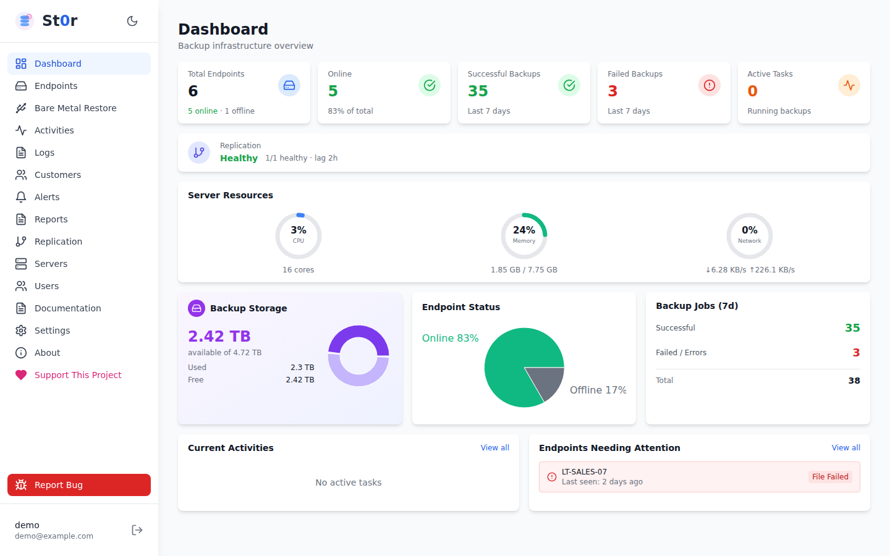
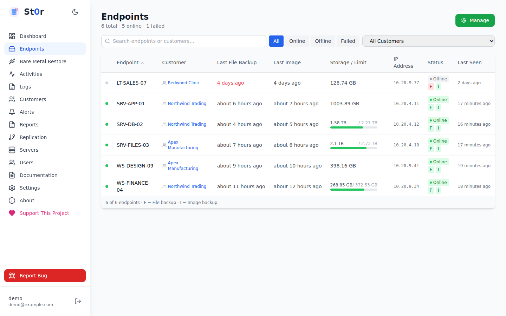
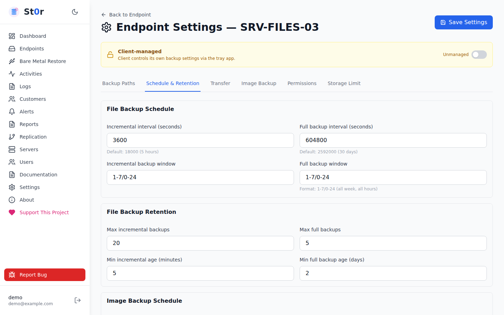
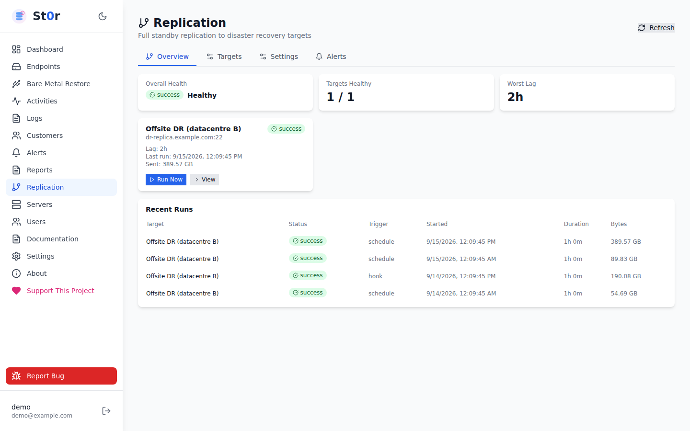
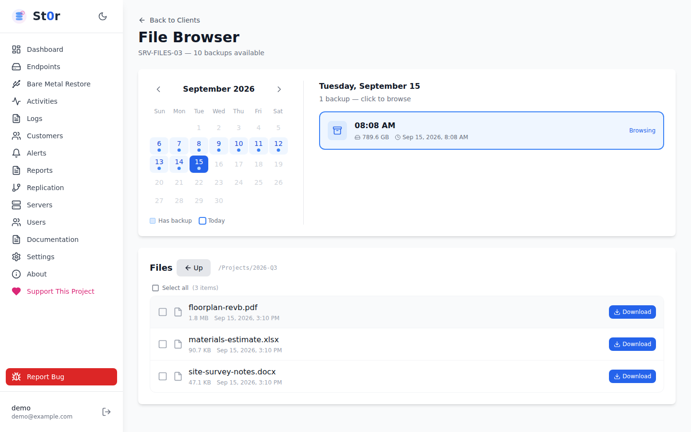

<div align="center">

# St0r

**A modern management interface for UrBackup.**

[](https://github.com/agit8or1/St0r/releases)
[](https://www.urbackup.org/)
[](#requirements)
[](LICENSE)

[Screenshots](docs/screenshots.md) · [Quick start](#quick-start) · [Compatibility](#requirements) · [Documentation](#documentation) · [Releases](https://github.com/agit8or1/St0r/releases)

</div>

---

St0r is a web interface for administrators who already run **UrBackup Server** and want a clearer way to
operate it day to day — seeing endpoint status, adjusting schedules and retention, browsing what was
backed up, and replicating the backup store offsite.

**St0r does not replace the backup engine.** UrBackup still performs every backup, owns the storage, and
decides what is recoverable. St0r reads UrBackup's own database and API and presents them; it changes
UrBackup's settings only where you ask it to. If St0r is stopped, backups continue exactly as before.



---

## Why St0r

**One view of every endpoint.** Online state, last file and image backup, storage against an optional
per-endpoint quota, and which endpoints need attention — in one table instead of several UrBackup screens.

**Schedules and retention without the settings maze.** Backup intervals, backup windows, retention counts,
excluded paths and per-endpoint storage limits are grouped into labelled tabs, with UrBackup's defaults
shown next to each field.

**Offsite replication you can actually see.** Push the backup store and its databases to a standby server
over SSH/rsync, with run history, bytes transferred, replication lag and alerting on failure.

> Replication copies your backup store to another machine. It is not a substitute for periodically
> performing a **test restore**, and it does not make backups immutable — deletions and corruption
> replicate too.

---

## A quick tour

| | |
|---|---|
|  | **Endpoints** — every endpoint with its customer, last backups, quota usage and status. Filter by state or customer. |
|  | **Schedules and retention** — intervals, backup windows and how many snapshots to keep, per endpoint. |
|  | **Replication** — target health, replication lag, and a history of each run. |
|  | **File browser** — pick a date, open a backup, and download individual files or folders. |

More screens in [docs/screenshots.md](docs/screenshots.md).

---

## How it works

St0r runs alongside UrBackup on the same machine and talks to it three ways:

1. **Reads UrBackup's SQLite databases directly.** `/var/urbackup/backup_server.db` for clients, backups,
   images and job logs, and `backup_server_settings.db` for settings. Most access is read-only; St0r opens
   them read-write for specific actions such as deleting a backup or applying a per-endpoint setting.
2. **Calls UrBackup's HTTP API** on `localhost:55414` to start and stop backups, read live progress, save
   client settings, and build pre-configured client installers.
3. **Reads the backup storage folder from disk** to browse and download files inside a backup. The folder
   location comes from UrBackup's settings database, so it follows the path UrBackup actually uses.

Its own data — user accounts, customers, replication configuration and history — lives in a separate
MariaDB database and never mixes with UrBackup's.

**Installation on the same server as UrBackup is required.** The SQLite databases and the backup storage
are opened as local files, so a remote UrBackup server is not supported. St0r manages one UrBackup
instance: the one on the same host.

---

## Requirements

| | |
|---|---|
| **UrBackup Server** | 2.5.x — developed and verified against **2.5.38** |
| **Operating system** | Ubuntu or Debian (the installer is `apt`-based) |
| **Runtime** | Node.js 20+, MariaDB, Nginx — installed for you by `install.sh` |
| **Location** | Same host as UrBackup Server |

Other distributions, and UrBackup releases outside 2.5.x, are untested rather than known-broken.

---

## Quick start

```bash
curl -fsSL https://raw.githubusercontent.com/agit8or1/St0r/main/install.sh | sudo bash
```

Then open `http://YOUR_SERVER_IP`.

### What the installer changes

Read this before running it on a server that already serves web content:

- **Installs packages:** Node.js 20, MariaDB, Nginx, `rsync`, `sqlite3`, `curl`, `gnupg2`. If UrBackup
  Server is not present, it installs that too.
- **Takes over Nginx's default site.** It writes `/etc/nginx/sites-available/urbackup-gui`, enables it as
  `listen 80 default_server`, and **removes `/etc/nginx/sites-enabled/default`**. If something else already
  serves port 80 or claims `default_server`, expect a conflict — put St0r behind your existing proxy
  instead (the backend listens on `127.0.0.1:3000`).
- **Serves plain HTTP on port 80.** No TLS is configured. Terminate TLS at your own proxy before exposing
  St0r to anything untrusted.
- **Adjusts UrBackup database permissions.** It adds the service user to the `urbackup` group and makes
  `/var/urbackup/backup_server*.db` group-writable, so St0r can perform the write operations above.
- **Creates a systemd service** `urbackup-gui` and a MariaDB database `urbackup_gui`.

### First login

The first run creates an administrator account with **the well-known default credentials
`admin` / `admin123`**. Signing in with that password opens a change-password dialog.

Until that password is changed, be aware of how St0r advertises it:

- `GET /api/setup/status` needs no authentication and reports whether the default password is still in use.
- While it is, **the login page displays the username and password on screen** to anyone who opens it.

Change the password before the server is reachable by anyone you do not trust, ideally before it leaves
localhost. This is a real weakness, documented here rather than glossed over — see
[Known limitations](#known-limitations).

Manual, step-by-step installation is documented in
[docs/installation.md](docs/installation.md).

---

## Documentation

| Topic | Where |
|---|---|
| Manual installation, configuration reference | [docs/installation.md](docs/installation.md) |
| Updating and uninstalling | [docs/installation.md](docs/installation.md#updating) |
| Backing up St0r's own database | [docs/installation.md](docs/installation.md#backing-up-st0rs-own-database) |
| Backing up UrBackup's databases | [docs/URBACKUP_DATABASE_BACKUP.md](docs/URBACKUP_DATABASE_BACKUP.md) |
| Full screenshot catalogue | [docs/screenshots.md](docs/screenshots.md) |
| UrBackup API reference used by St0r | [docs/URBACKUP_API_COMPLETE_REFERENCE.md](docs/URBACKUP_API_COMPLETE_REFERENCE.md) |
| Deployment notes | [DEPLOYMENT.md](DEPLOYMENT.md) |
| Release history | [CHANGELOG.md](CHANGELOG.md) · [Releases](https://github.com/agit8or1/St0r/releases) |

---

## Known limitations

- **Default credentials on first run.** `admin` / `admin123` is created automatically. Until it is changed,
  an unauthenticated endpoint reports that the default is in use and the login page shows the credentials
  on screen. Signing in with them opens a change-password dialog.
- **No TLS out of the box.** The installer configures plain HTTP on port 80.
- **One UrBackup server per installation**, on the same host. There is no aggregated view across several
  UrBackup servers.
- **Ubuntu and Debian only.** The installer assumes `apt`.
- **The installer disables Nginx's default site**, which can disrupt an existing web server.
- **St0r writes to UrBackup's databases** for some operations. Keep your own backup of `/var/urbackup`.
- **Replication is push-only over SSH/rsync** to a standby server, and it is a copy, not an independent
  verified restore.

---

## Security

Please do not report security issues in public GitHub issues. Use a
[private security advisory](https://github.com/agit8or1/St0r/security/advisories/new), or email the
maintainer. Full policy: [SECURITY.md](SECURITY.md).

## Support and contributions

Questions and bug reports: [GitHub Issues](https://github.com/agit8or1/St0r/issues).
Pull requests are welcome — please open an issue first for anything substantial.

## License

[MIT](LICENSE).

---

<div align="center">
<sub>Project managed by <b>Mia</b> the GSD 🐾</sub>
</div>
