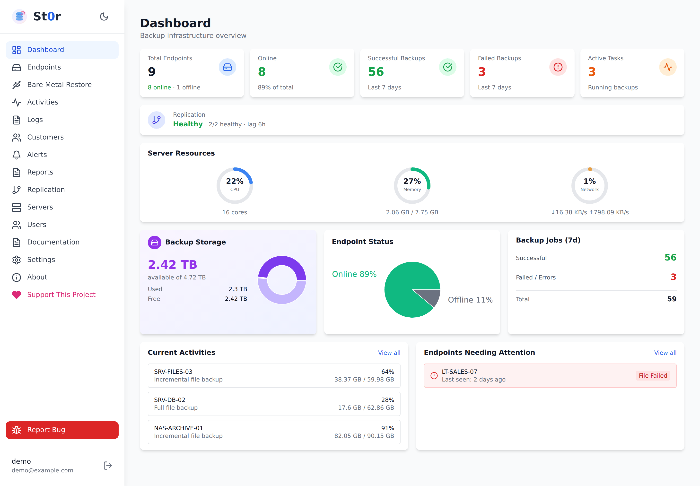
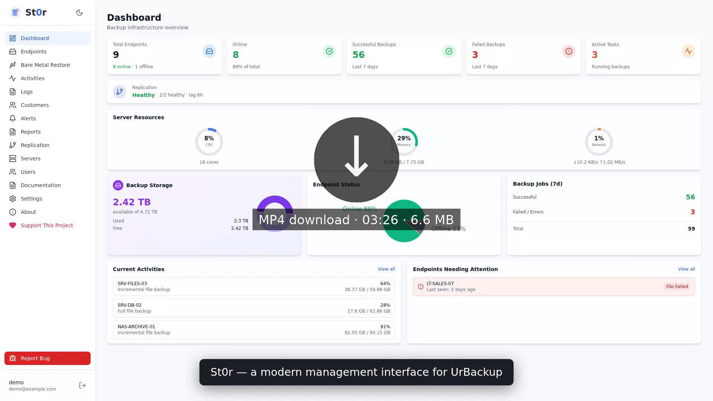
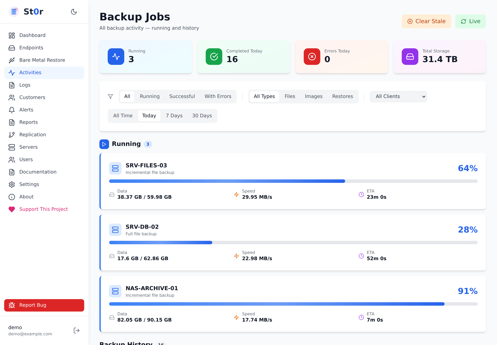
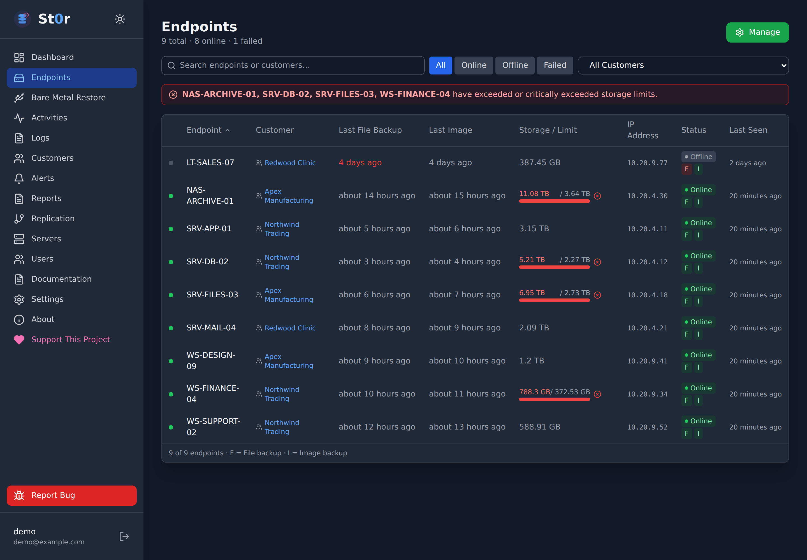
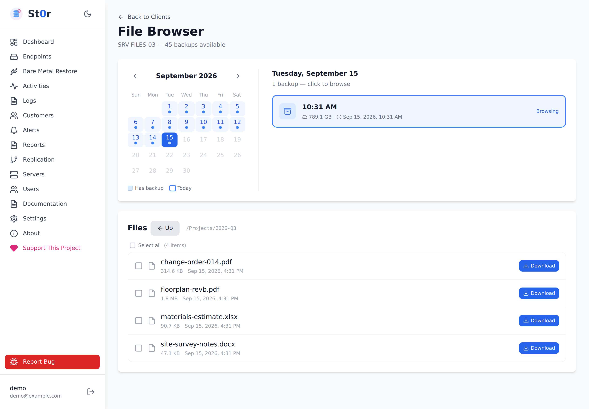
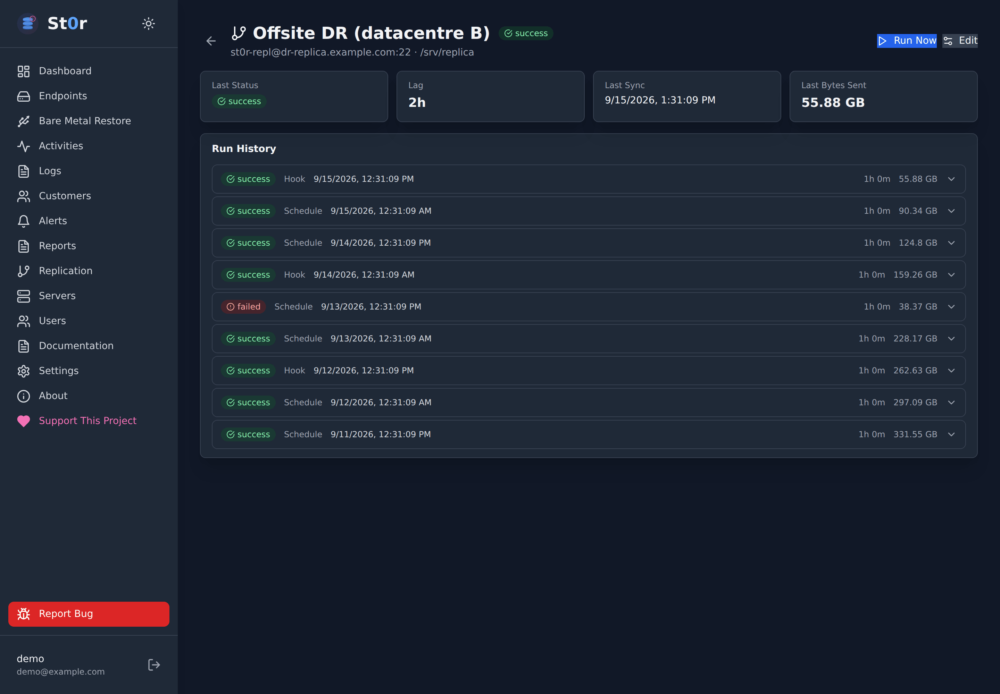
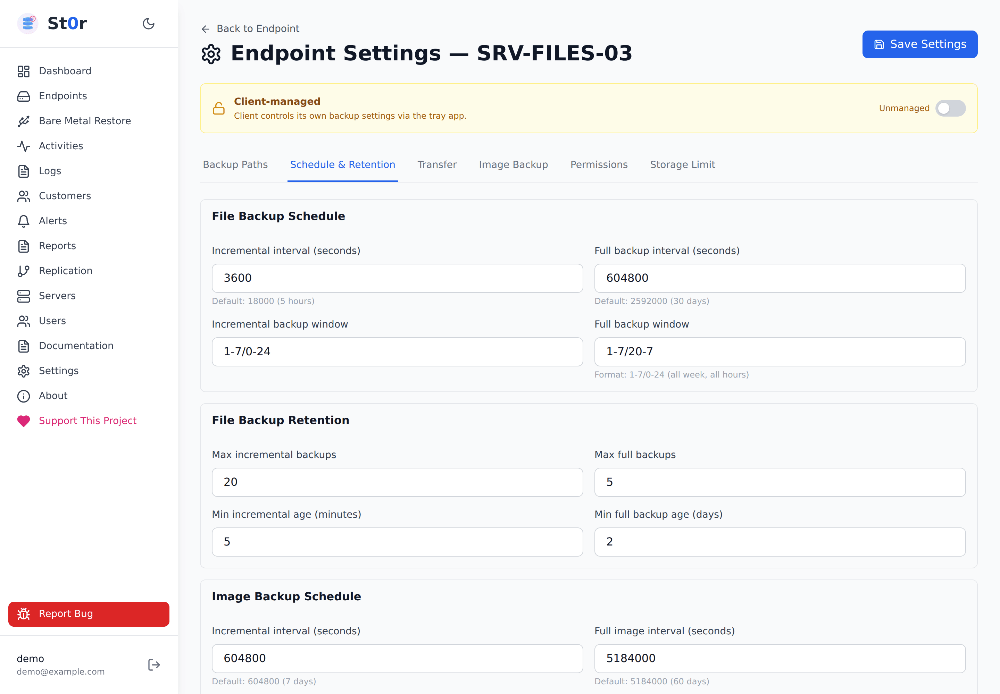
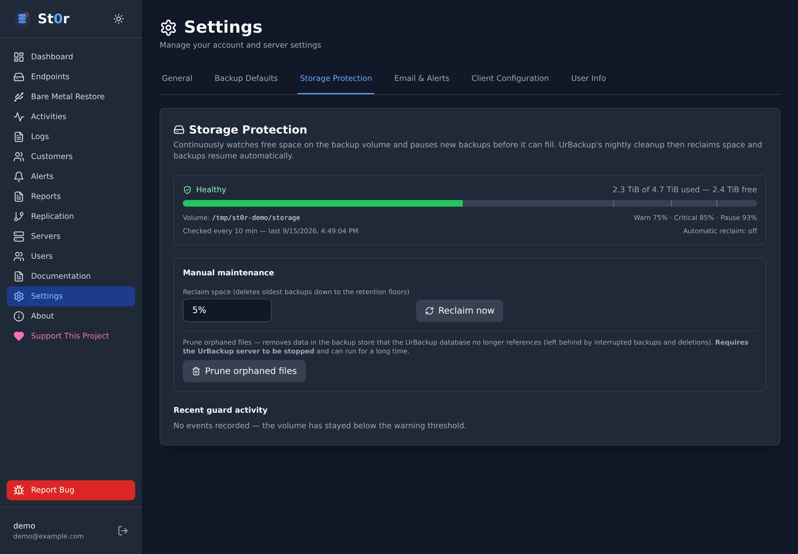

<div align="center">

# St0r

**A modern management interface for UrBackup.**

[](https://github.com/agit8or1/St0r/releases)
[](LICENSE)
[](https://www.urbackup.org/)
[](#requirements)

[Quick start](#quick-start) · [Walkthrough](#watch-the-walkthrough) · [Screenshots](docs/screenshots.md) · [Documentation](#documentation) · [Releases](https://github.com/agit8or1/St0r/releases) · [MSP Reboot](https://mspreboot.com)

</div>

---

St0r is a web interface for administrators who already run **UrBackup Server** and want a clearer way to
operate it day to day — seeing endpoint status, adjusting schedules and retention, recovering files, and
replicating the backup store offsite.

**It does not replace the backup engine.** UrBackup still performs every backup, owns the storage, and
decides what is recoverable. St0r reads UrBackup's own database and API and presents them; it changes
UrBackup's settings only where you ask it to. Stop St0r and backups carry on exactly as before.



---

## Why St0r

**One view of every endpoint.** Online state, last file and image backup, storage against an optional
quota, and what needs attention — in one table instead of several UrBackup screens.

**Schedules and retention without the settings maze.** Intervals, backup windows, retention counts,
excluded paths and per-endpoint quotas, grouped into labelled tabs with UrBackup's defaults beside each
field.

**Offsite replication you can actually see.** Push the backup store to a standby server over SSH/rsync,
with run history, bytes transferred, replication lag and alerting on failure.

> Replication copies your backup store to another machine. It is not a substitute for periodically
> performing a **test restore**, and it does not make backups immutable — deletions and corruption
> replicate too.

---

## Watch the walkthrough

[](https://github.com/agit8or1/St0r/releases/download/v3.2.116/st0r-walkthrough.mp4)

A short tour of the dashboard, endpoint health, recovering a file, schedules and retention, and offsite
replication — in both themes. GitHub will not play it inline, so the poster above **downloads the MP4**
(3:26, 6.6 MB).
[Highlight clip](https://github.com/agit8or1/St0r/releases/download/v3.2.116/st0r-highlight.mp4) —
also a download (0:45, 1.7 MB) ·
[Transcript](docs/media/st0r-walkthrough-transcript.md) — reads in the browser

---

## See it in action

A sample of the interface in both themes. The [full gallery](docs/screenshots.md) has 26 screens.

### Know what is running, right now

[](docs/images/github/activity-progress-light.png)

Live progress for every running job — data, throughput and time remaining — with filters by state, type,
endpoint and period. *Light theme.*

### Every endpoint, grouped by customer

[](docs/images/github/endpoints-dark.png)

Last backup, quota usage and status per endpoint, filterable by state or customer. *Dark theme.*

### Recover a single file

[](docs/images/github/file-browser-light.png)

Pick a day, open that day's backup, browse in and download a file or a whole folder. *Light theme.*

### Replicate offsite, and prove it ran

[](docs/images/github/replication-runs-dark.png)

Status, trigger, duration and volume for every run — including the ones that failed. *Dark theme.*

### Tune schedules and retention per endpoint

[](docs/images/github/schedule-retention-light.png)

Intervals, windows and how many snapshots to keep, with UrBackup's default beside each field.
*Light theme.*

### Watch capacity before it bites

[](docs/images/github/disk-guard-dark.png)

Free space against warning, critical and emergency thresholds — backups pause before the volume can
fill, and resume once cleanup reclaims space. *Dark theme.*

**[Browse all 26 screenshots →](docs/screenshots.md)**

---

## How it works

St0r runs alongside UrBackup on the same machine and talks to it three ways:

1. **Reads UrBackup's SQLite databases directly** — `/var/urbackup/backup_server.db` for clients, backups,
   images and job logs, and `backup_server_settings.db` for settings. Mostly read-only; opened read-write
   for specific actions such as deleting a backup or applying a per-endpoint setting.
2. **Calls UrBackup's HTTP API** on `localhost:55414` to start and stop backups, read live progress, save
   client settings and build pre-configured installers.
3. **Reads the backup storage folder from disk** to browse and download files. The location comes from
   UrBackup's settings database, so it follows the path UrBackup actually uses.

Its own data — accounts, customers, replication configuration and history — lives in a separate MariaDB
database and never mixes with UrBackup's.

**Installation on the same server as UrBackup is required.** The SQLite databases and the backup storage
are opened as local files, so a remote UrBackup server is not supported. St0r manages one UrBackup
instance: the one on the same host.

---

## Requirements

| Requirement | Detail |
|---|---|
| **UrBackup Server** | 2.5.x — developed and verified against **2.5.38** |
| **Operating system** | Ubuntu or Debian (the installer is `apt`-based) |
| **Runtime** | Node.js 20+, MariaDB, Nginx — installed for you by `install.sh` |
| **Location** | Same host as UrBackup Server |

Other distributions, and UrBackup releases outside 2.5.x, are untested rather than known-broken.

---

## Quick start

```bash
curl -fsSL https://raw.githubusercontent.com/agit8or1/St0r/main/install.sh | sudo bash
```

Then open `http://YOUR_SERVER_IP`.

### What the installer changes

Read this before running it on a server that already serves web content:

- **Installs packages:** Node.js 20, MariaDB, Nginx, `rsync`, `sqlite3`, `curl`, `gnupg2`. If UrBackup
  Server is absent, it installs that too.
- **Takes over Nginx's default site.** It enables its own site as `listen 80 default_server` and **removes
  `/etc/nginx/sites-enabled/default`**. If something else already serves port 80, put St0r behind your
  existing proxy instead — the backend listens on `127.0.0.1:3000`.
- **Serves plain HTTP on port 80.** No TLS is configured. Terminate TLS at your own proxy before exposing
  St0r to anything untrusted.
- **Adjusts UrBackup database permissions** — adds the service user to the `urbackup` group and makes
  `/var/urbackup/backup_server*.db` group-writable.
- **Creates a systemd service** `urbackup-gui` and a MariaDB database `urbackup_gui`.

### First login

The first run creates an `admin` account with **a password generated for your installation** — there is no
shared default. The installer prints it when it finishes, and it is also written to
`/opt/urbackup-gui/initial-admin-password.txt` (mode 0600) and logged once:

```bash
sudo journalctl -u urbackup-gui | grep -A3 "First run"
```

You must change it at first login. Delete the password file once you have signed in.

Manual, step-by-step installation is in [docs/installation.md](docs/installation.md).

---

## Documentation

| Topic | Where |
|---|---|
| Manual installation, configuration reference | [docs/installation.md](docs/installation.md) |
| Updating and uninstalling | [docs/installation.md](docs/installation.md#updating) |
| Backing up St0r's own database | [docs/installation.md](docs/installation.md#backing-up-st0rs-own-database) |
| Backing up UrBackup's databases | [docs/URBACKUP_DATABASE_BACKUP.md](docs/URBACKUP_DATABASE_BACKUP.md) |
| Full screenshot gallery | [docs/screenshots.md](docs/screenshots.md) |
| Walkthrough transcript | [docs/media/st0r-walkthrough-transcript.md](docs/media/st0r-walkthrough-transcript.md) |
| Regenerating the screenshots and video | [scripts/demo/README.md](scripts/demo/README.md) |
| UrBackup API reference used by St0r | [docs/URBACKUP_API_COMPLETE_REFERENCE.md](docs/URBACKUP_API_COMPLETE_REFERENCE.md) |
| Release history | [CHANGELOG.md](CHANGELOG.md) · [Releases](https://github.com/agit8or1/St0r/releases) |

---

## Known limitations

- **The first-run password is written to disk.** Generated per installation, not shared, but it sits in
  `/opt/urbackup-gui/initial-admin-password.txt` at mode 0600 and in the service log until you change the
  password and delete the file.
- **No TLS out of the box.** The installer configures plain HTTP on port 80.
- **One UrBackup server per installation**, on the same host. There is no aggregated view across several
  UrBackup servers.
- **Ubuntu and Debian only.** The installer assumes `apt`.
- **The installer disables Nginx's default site**, which can disrupt an existing web server.
- **St0r writes to UrBackup's databases** for some operations. Keep your own backup of `/var/urbackup`.
- **Replication is push-only over SSH/rsync** to a standby server, and it is a copy, not an independent
  verified restore.

---

## Security

Please do not report security issues in public GitHub issues. Use a
[private security advisory](https://github.com/agit8or1/St0r/security/advisories/new), or email the
maintainer. Full policy: [SECURITY.md](SECURITY.md).

## Support and contributions

Questions and bug reports: [GitHub Issues](https://github.com/agit8or1/St0r/issues).
Pull requests are welcome — please open an issue first for anything substantial.

---

## MSP Reboot

St0r's author also runs **[MSP Reboot](https://mspreboot.com)** — MSP consulting on pricing, operations,
margins, service delivery and technology strategy, from a former 25-year MSP owner, offering a free
introductory hour.

**Hosting and support for St0r are available through MSP Reboot** if you would rather not run it yourself,
or want someone to call when it matters. [Get in touch](https://mspreboot.com) for what that covers.

None of it is required: St0r is MIT-licensed and self-hosted, the software is free to run with no paid
tier, and bug reports are handled in the open on [GitHub Issues](https://github.com/agit8or1/St0r/issues)
whether or not you are a customer.

---

<div align="center">
<sub>Project managed by <b>Mia</b> the GSD 🐾 · <a href="https://mspreboot.com">mspreboot.com</a></sub>
</div>
