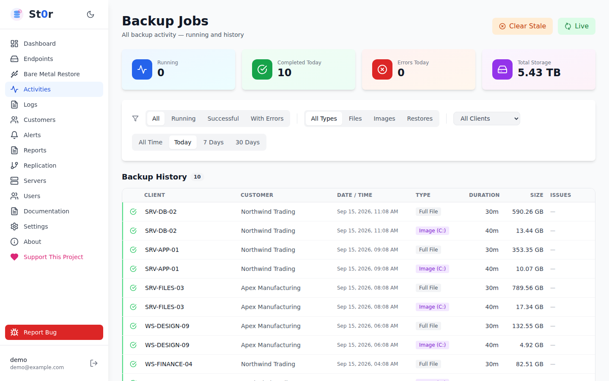
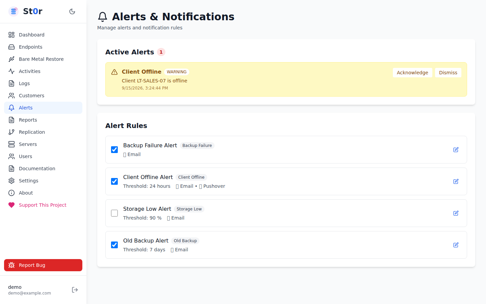
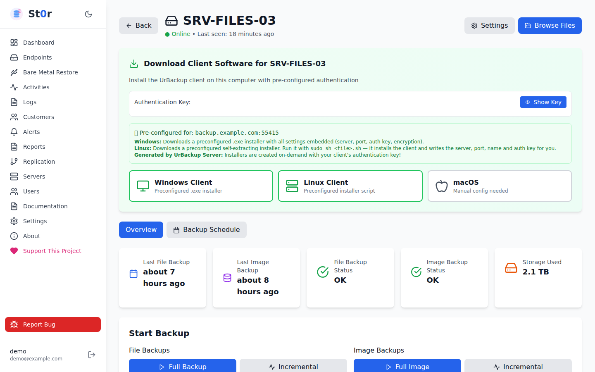
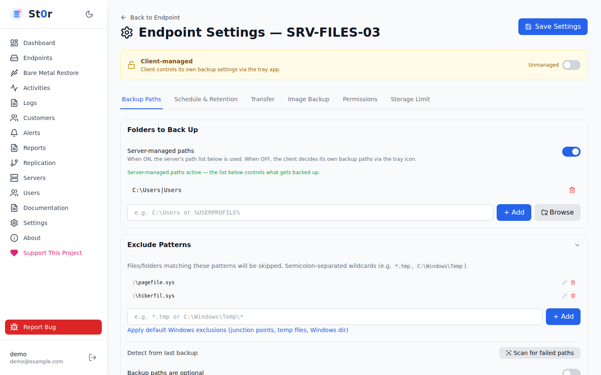
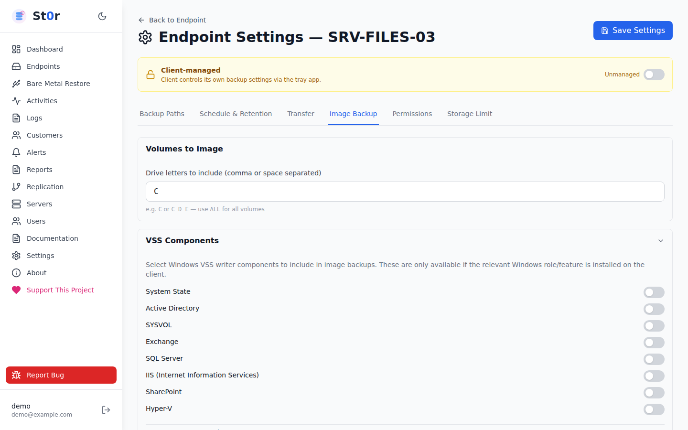
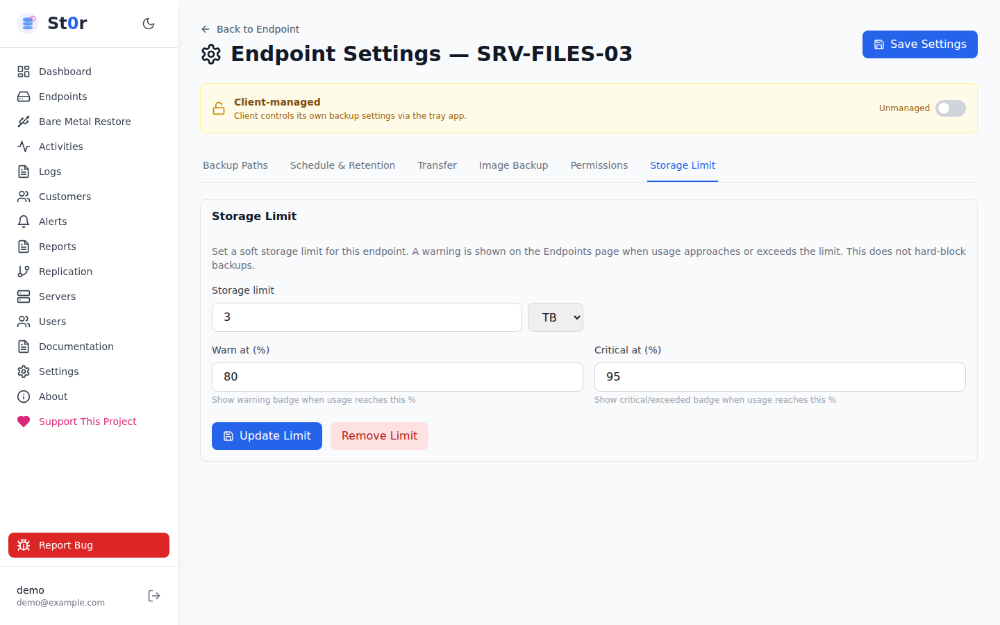
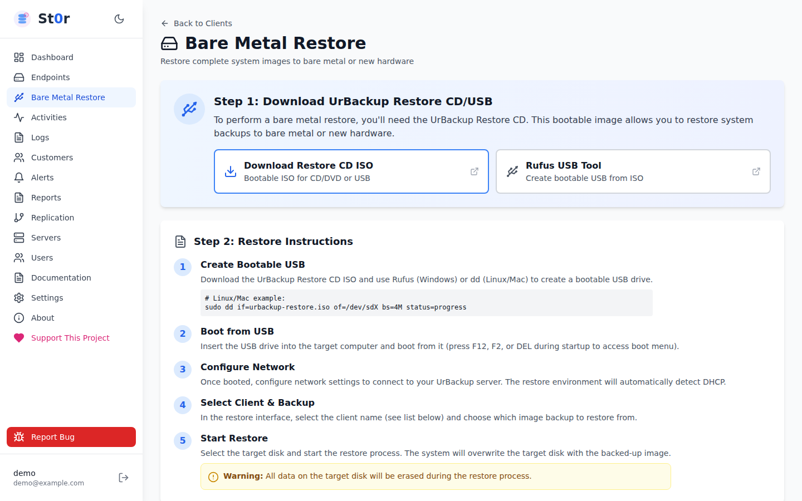
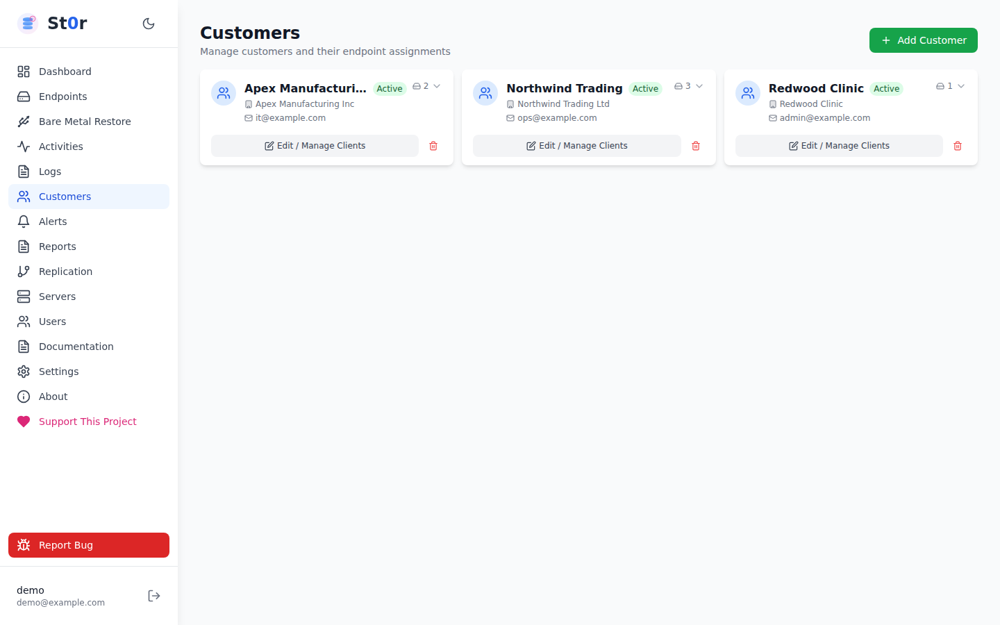
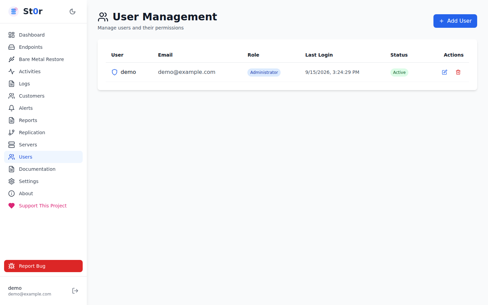
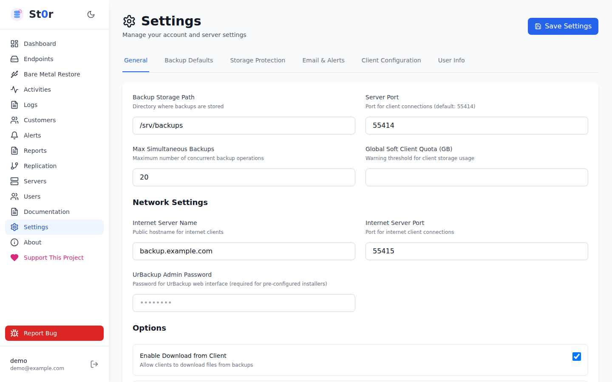

# Screenshots

Every image is a real capture of the St0r interface at 1440×900, taken against a disposable demo
environment with fabricated endpoints, customers and file names. No production data appears in them.

Back to the [README](../README.md).

---

## Overview

### Dashboard

Estate summary: endpoint counts, backup job totals for the last seven days, replication health, server
resources, storage capacity, and any endpoints needing attention.

### Endpoints

Every endpoint with its customer, last file and image backup, storage against an optional quota, IP
address and status. Filterable by state or customer.

### Activities

Running and recent backup jobs, with progress and the ability to stop a running job.

### Alerts

Endpoints whose backups are failing or overdue.

---

## Endpoint management

### Endpoint detail

One endpoint's status, backup history and per-endpoint actions.

### Backup paths

Which folders are backed up, and whether the server or the client decides.

### Schedule and retention

Incremental and full intervals, backup windows, and how many snapshots to keep.

### Image backup

Image backup schedule and retention, and which volumes are imaged.

### Storage limit

An optional per-endpoint quota with warning and critical thresholds.

---

## Recovery

### File browser

Pick a date, open a backup from that day, and download individual files or folders.

### Bare metal restore

Guidance for restoring a full system image, and export of an image backup as a VHD.

---

## Replication

Target health, replication lag, and the history of each run.

Replication copies the backup store to a standby machine. It is not a substitute for a tested restore,
and it does not make backups immutable.

---

## Administration

### Customers

Group endpoints under a customer, and scope read-only accounts to them.

### Users

Administrator and read-only accounts. Read-only accounts can be limited to specific customers' endpoints.

### Settings

Server-wide configuration: storage path, ports, internet client settings and backup defaults.

